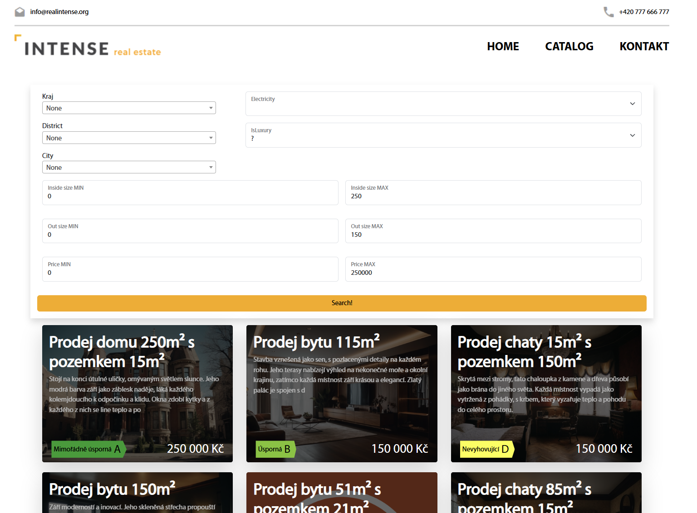
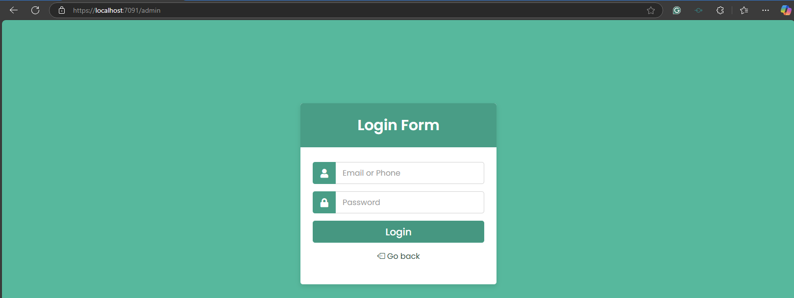
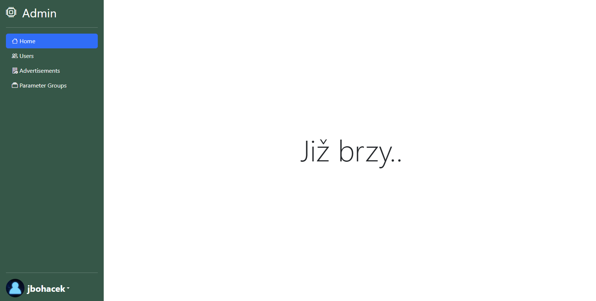
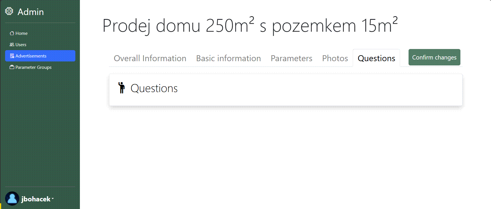
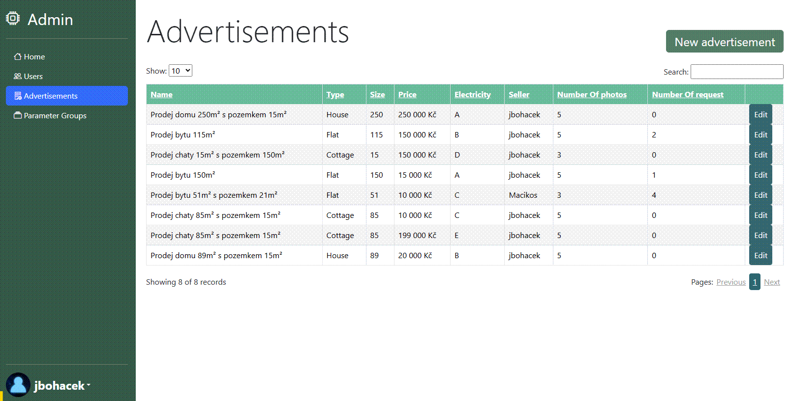
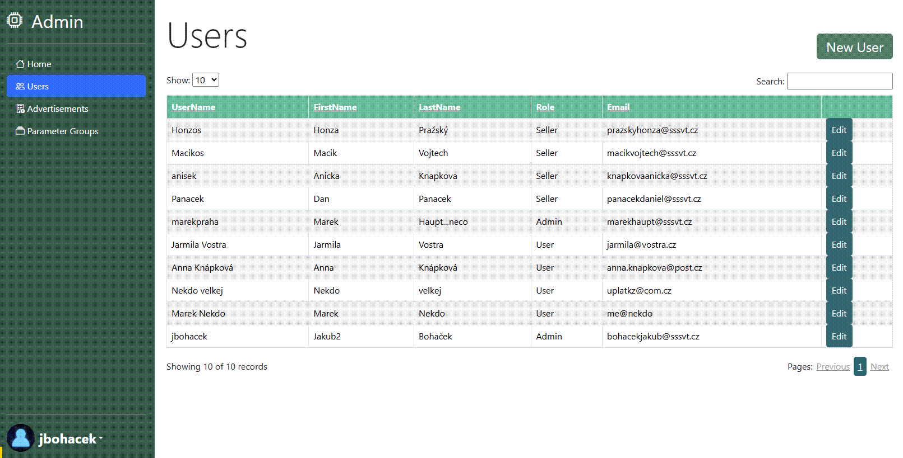

# Relity project web

Tenhle web byl vytvořen jako závěrečný projekt na programování na SSSVT na platformě ASP.NET.

Tématem je web na realitky(web na inzeraci bytů), kde je možné kontaktovat prodavače a prodavači jsou možný vytvářet inzeráty na které pak možný zákazníci mužou reagovat. Design webu byl předen daný, avšak bylo nutné ho napsat přes CSS.

Cílem bylo prověřit a zlepšit znalostí
- css (bootstrapu), html, javascriptu
- asp.net a c#
- MSSSQL a Entity Frameworku

V projektu najdete
- Základní operace CRUD na uživatele a inzeráty
- Zabezepčení admin panelu před zneužítím

## Procházení inzerátů

Všechny inzeráty jsou rozdělený do 4 kategorii
- Byty
- Luxusní
- Domy
- Chaty
V databázi jsou také naimportované všechny česká města.

*(web běžel na netu nějakou chvilku a kluci tam přidali nahodný obrázky, omluvte duck duck go :D )*

Web disponuje komplexním vyhledáváním inzerátů

## Administrace

Po zadání /admin za url. Dostanete se do administračního panelu, kde mužete uprvait uživate a inzeráty. Admin má přístup k uživatelům a ke všem dotazům naopak prodavač má pouze k dispozici svoje inzeráty. Domovská stránka se musí dodělat s grafy, pravděpodobně nikdy se nedodělá :)

## Inzeráty

Každý inzerát má uložené tyhle informace:
- počet shlednutí na webu
- cenu
- typ (Byty, luxunsí, Domy, Chaty)
- velikost bytu, velikost zahrady
- využití elektřiny
- fotky
- dotazy
- Jeho parametry, jejich typy jsou upravit v záložce Pamater Group

Jde vytvořit, editovat a mazat inzeráty.

### Parametry

Každý inzerát má vlastní parametry a typy těchto parametrů jde editovat v admin panelu.

## Uživatelé

Administrátor má právo přidávat, editovat a mazat uživatele. Existují 3 typy uživatelům
- User
- Seller
- Administrator 

User nemá žádné práva a existuje jako potencialní zákazník. Seller muže vytvářet, editovat a mazat inzeráty. Administrátor má všechny práva

Na hesla používám Bcrypt

# Postup na instalaci
1) Naklonujte
2) Vytvořte databázi pomocí "dbRealitkyWebZaloha.sql"
3) spusťe projekt

#### Admin účet:

Username: jbohacek

Heslo: andilek 